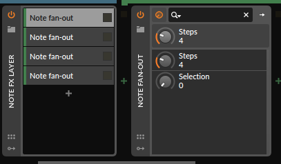
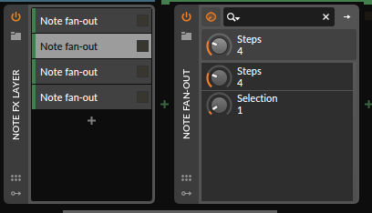
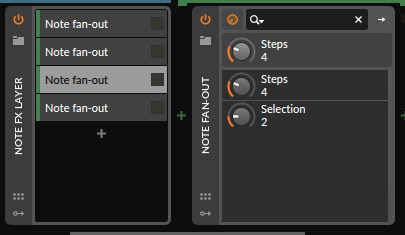
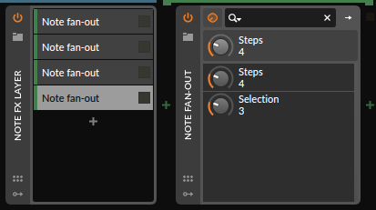
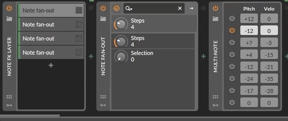
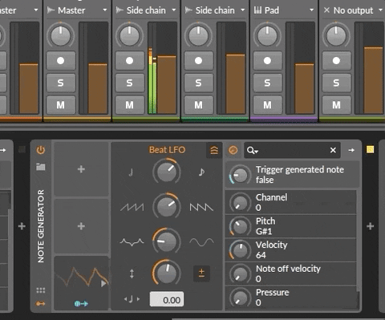

# Collection of note effects VSTs

- [Delay notes off, notes limit](#delay-notes-off-and-limiting-amount-of-running-notes)
- [Note fan-out](#note-fan-out)
- [Note generator](#note-generator)
- [Non-notes filter](#non-notes-filter)

These VST plugins were made possible thanks to https://github.com/RustAudio/vst-rs

I made those plugins because some features cannot be achieved with just bitwig devices.

## Delay notes off and limiting amount of running notes

`note_off_delay` provides a feature similar to note latch, except that instead of leaving the note run forever, after the original note is stopped, it will still run for a configurable amount of time. This is implemented by delaying the note off midi message ; this can be considered as some sort of sustain pedal.

The plugin can also limit the amount of running notes, stopping the oldest note if an incoming note exceeds the configured limit. Both effects can be used independently or together.

The note off delay can be useful when jamming, making the sound fuller without having to keep your hands on the keys ; combined with the notes limit, this avoids saturation and dissonance despite the long running notes. You may want to split the note ranges using a Note FX layer and note filters, so low notes and high notes have different lengths and playing notes limit. 

## Note fan out

This plugin lets in one note out of N steps, allowing you to build a fan-out device by adding several copies of it in a note FX layer and selecting a different step for each. From there you could for instance have a note effect that only applies to Nth notes, or make a mono instrument polyphonic by having several copies of it ( use an instrument layer in that case ).

   

Using channel distribution each note will get a different channel. In order to not interfere with MPE, it starts at channel 2.

Using Bitwig's _note counter_ modulator on a selector FX should just do that, except that the modulation signal is not straightforward to troubleshoot.

## Note Generator

This VST is able to generate notes with configurable channel, velocity, pitch, and release velocity.
It can also independently generate pressure ( 0xD0 ) and pitch bend ( 0xE0 ) midi messages. Those messages cannot be independently produced by Bitwig, except by explicitly drawing them in a clip.

In order to generate a note, just select the channel, pitch and velocity and move the trigger above 50%, and a note will be generated.

If you can modulate those parameters like here in bitwig with a beat LFO, you can easily generate notes.

Find here a screen recording to get a better idea:

## Non-notes filter

Some VSTs may misbehave when receiving unsupported CCs and other midi messages. Using a note filter Bitwig allows to block all notes and just leave other messages, this plugin does the opposite: any midi message that is not in the range 0x80 ( note off channel 1 ) - 0x9F ( note on channel 16 ) is filtered out.

## Building the VSTs

Requires Rust ( https://www.rust-lang.org/tools/install ), also check https://github.com/RustAudio/vst-rs on how to build VST plugins.

The repository includes a modified version of [osx_vst_bundler.sh](https://github.com/RustAudio/vst-rs/blob/master/osx_vst_bundler.sh) that creates VST bundles for Mac OS X 

You'll get in `artefact` `.vst` bundles that you can put in a directory where your DAW finds plugins.
